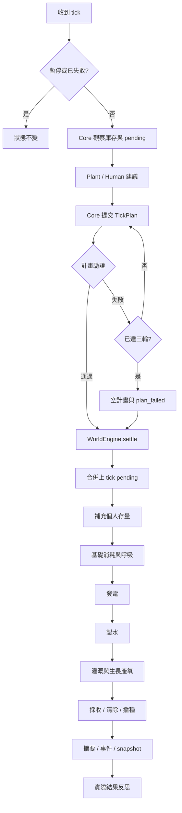

# Tick 結算與權威狀態

世界參數唯一來源是 `shared/crops.json` 與 `shared/world_constants.json`。所有來源章節隨數值保存，衍生值由後端公式計算。

每個個人消耗與公共氧氣消耗點立即檢查死亡；任一 crew 死亡即停止後續階段，仍產生失敗事件與快照。動畫與 Agent 訊息不再次結算。

## 已核准的規格釐清

- 本次採 spec 的下一 tick pending 入庫機制，與 guide「採收當下入庫」字義有差異。產出時按 `resources.value + pending` 預留容量；下一 tick 的引擎才合併，前端把 pending 顯示為待入庫。Core 的 snapshot 包含兩者。
- 玩家編輯走 `WorldEngine.edit_resources` 專用純函數，由 orchestration 序列化提交；被編輯資源的 pending 同步清零。它是經批准的 tick 之外修改路徑，REST 不直接改 state。
- 任務失敗後不能藉資源補充復活；重新開始須明確 reset。
- 空計畫是三輪無效計畫後的指定行為，不是引擎自動替 Core 分配工作。其他執行錯誤暫停世界。
- 發電縮量依 guide 的請求上限比例公式，屬世界規則；其餘分配順序來自 TickPlan。
- `refills.amount` 是本次最小 schema 擴充，正式工具仍待定；補充與地塊操作不延續到下一 tick。
- 真實結果的 reflection 在 settle 後產生，不能在 plan 階段宣稱已成功執行。
- 原 spec 的 `8,000 + 20 塊產氧 > 15,000` 前提不成立；初始配比總產氧為 304。保留原文件，測試分別驗證不溢出及接近容量時的實際溢出。
- Phase 2 為完整驗證原表，提前建立 validator、玩家修改與政策掃描的必要純函數；後續階段再串接服務。

## Mock 與基準策略

使用者最新範圍為前後端整合。遊戲內 Agent、LLM provider、提示詞與記憶由隊友負責，本專案只提供外部計畫／訊息接口。展示 mock 回傳 fixture，仍經實際 validator 與 engine；它驗證協定與世界規則，不宣稱有即時 LLM 推理。前端獨立 mock 只重播由引擎產生的 snapshots，不能自算資源。

`checks/` 中基準排程是 guide 明示的測試策略例外；不得被正式引擎或真實 Agent provider 當成 fallback。原始基準腳本未提供，新的回歸測試只能聲稱自己的實測結果，不能冒稱歷史最低值精準復現。
